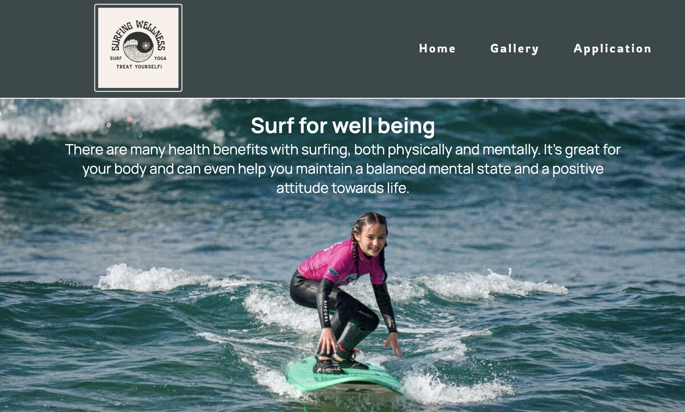

# Surfing-and-Wellness
Project 1 Code Institute

Surfing and wellness is a site to inspire users to do a different sport which can help them connect with themselves and nature. This website is targeted to people in need of new perspectives in life and with the desire to find a new support community. 
Users of this website can find information about our work and they can even complete an application to be part of these journeys.

Responsive Mockup

Features
Navigation Bar
* Featured on all three pages. You can go over the different parts of the website. Home will direct you to the main page. Gallery will direct you to the pictures of travels with Surfing Wellness. At the end we have the Application where people can write some information about themselves and be candidates to be part of the Surf and Wellness adventures. 

* The same navigation bar is avaiable on all three pages to make it possible return to de desired page.

* The navigation has also the logotype of "Surfing and Wellnes" which has a good contrast with the other colors of the page. 

The landing page image

The landing includes a photograph with text overlay to allow the user understand why is this concept important and how can people benefit from it. The image gives the user an ideaof................

Landing Page
Here we have more information about the programs and why are they relevant. 

Gallery Section

Here we have some pictures of the experiences. Meditation, surfing, socializing and connection with the nature are some of the highlights that can motivate users to be part of this eperience. 

Application Form

Here, can the users provide of basic information about themselves so the Surfing and Wellness team can organize the trips and contact the users about what is avaiable. 

Footer

The footer section includes links to the relevant social media sites for Surfing and Wellness which can keep our users connected. The links will open to a new tab to allow easy navigation for the user. Here we also provide our contact information. 

The gallery page

The user can see the adventures that we had with other groups an have apreciation of our work. 

Features Left to Implement
Add teachers and staff pictures on the site, with information about them and their experience. 
Add images that are already with the right size and with .webp to save time. The images has also to have a name without spaves otherwise W3 validator shows a misstake. 

Testing
Home, Gallery and Application work perfectly in all devices. You can return and go to all the pages from all the pages. 
The footer has the advantage to redirect the users to google maps, all social media avaiable and even email draft. 

The site is avaiable in on all devices bigger than  414px x 736px. 

An interesting mistake found on W3 code tester is the "meta" 
Attribute description" not allowed on element meta at this point. W3 validator

Some problems that I found are:
- Adjusting the footer to all devices.
- Reduce video prev. size
- Some css styling as flex-box

Validator Testing
HTML
No errors were returned when passing through the official W3C validator

CSS
No errors were found when passing through the official (Jigsaw) validator

Unfixed Bugs
You will need to mention unfixed bugs and why they were not fixed. This section should include shortcomings of the frameworks or technologies used. Although time can be a big variable to consider, paucity of time and difficulty understanding implementation is not a valid reason to leave bugs unfixed.

Deployment

The site was deployed to GitHub pages. The steps to deploy are as follows:
In the GitHub repository, navigate to the Settings tab.
From the "Code and automation" source select "pages"
On Github Pages find "Source", choose "deploy from a branch".
On branch you will find two dop-down menus. Choose "main", "root" and push the "save button".
Once the master branch has been selected, the page will be automatically refreshed with a detailed ribbon display to indicate the successful deployment.
The live link can be found here - https://quetzaly88.github.io/Surfing-and-Wellness/

Credits
My code was mostly based from the "Love running" walk-through project and 
Many other credits are to YouTube Tutorials from:
- Dave Gray teaches code. I got information about Media Query. https://youtu.be/mpYtrgB3b6o?si=tcBwVgdc5glg_Nvu
- Kevin Powell teaches the CSS common misstakes.  https://youtu.be/rxnX1jdoI6c?si=MVfpxYCRFvbaRnaU
- Skillthrive. Here I got inspiration for the navigation bar. https://youtu.be/PwWHL3RyQgk?si=pcpu4M5ay6js0GTn
- W3 validator to check HTML. https://validator.w3.org/

Media Content
- Image resize. https://www.iloveimg.com/resize-image
- Downloaded Pictures. https://www.pexels.com/
- Webp converter app. https://anywebp.com/
- Image size. https://tiny-img.com/blog/best-image-size-for-website/
- Fav icons, social media icons and fond types. https://fontawesome.com/account/general
- Logotype for Surfing and Wellness: https://www.canva.com/
- Responsive mockups. https://youtu.be/Dtad5Ml2UrM?si=vhLDkJcgY4tHJHus and .............

Text content

The text content is from myself. I wrote things that I wish to accomplish one day. Some of the text for the Home page was taken from:
-https://sunwavesurfcamp.com/blog/show/161-5-health-benefits-of-surfing

skiss.   https://balsamiq.com/

[main-page]: Screenshot-main-page.webp