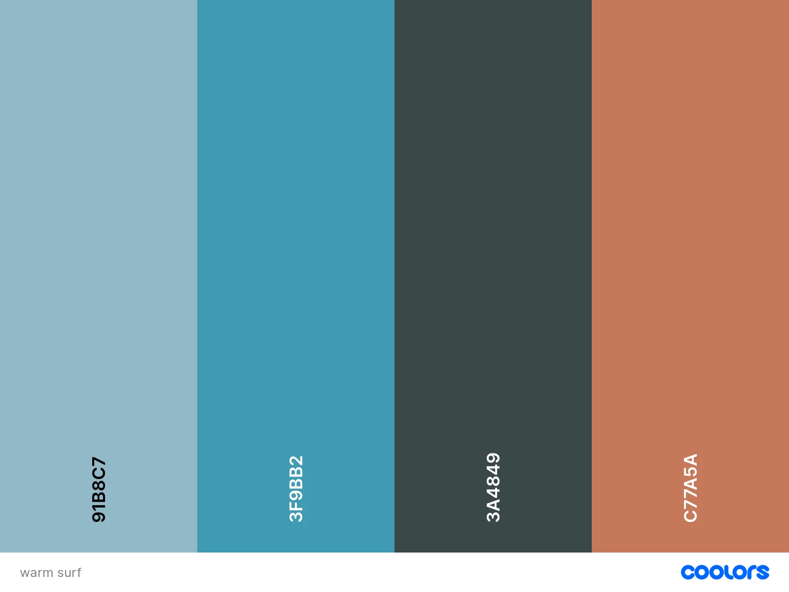
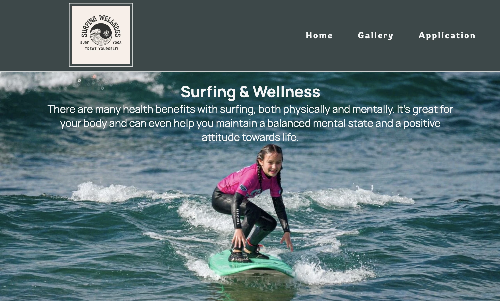
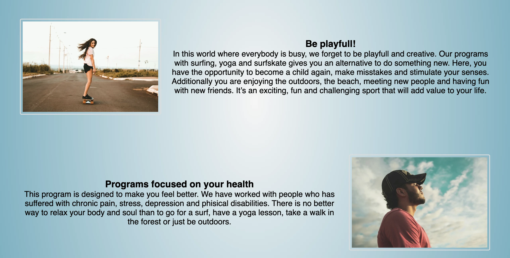
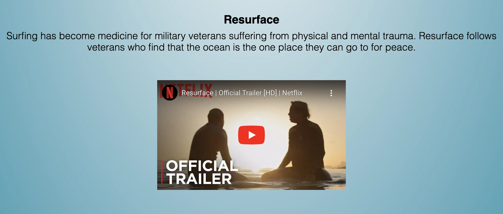
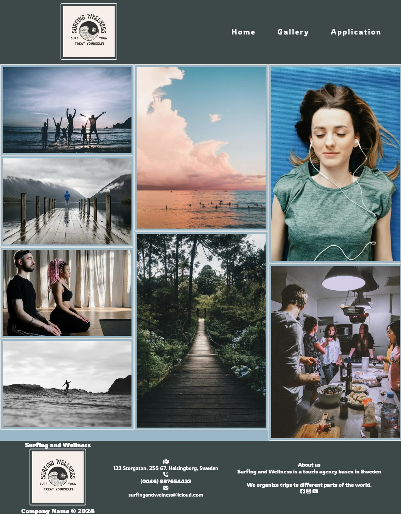
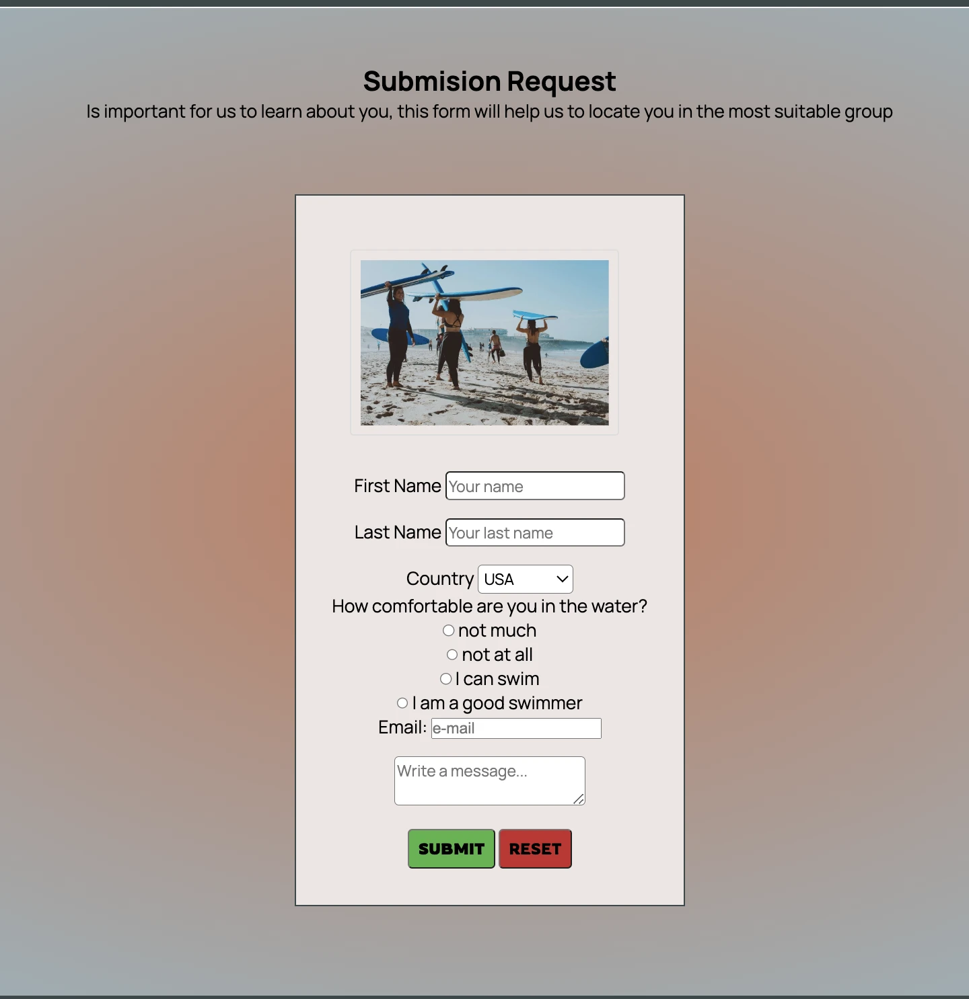
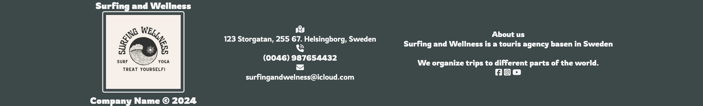

# Surfing-and-Wellness
Project 1 Code Institute

Surfing and wellness is a site to inspire users to do a different sport which can help them connect with themselves and nature. This website is targeted to people in need of new perspectives in life and with the desire to find a support community. 
Users of this website can find information about our work and they can even complete an application to be part of these journeys.

User Experience (UX)
Responsive Mockup

Design

Colour Scheme

I chosed warm tones for my website in order to communicate peace and relaxation. The colors match to the pictures too. 
I used coolors.co to be able to match correctly all the tones. The dark color was used on header and footer. The ligter colors were used as background colors with gradienst property. 

Typography

The chosen typography was adquired from fonts google.
I chose "Manrope" for the main text because is a redable font and adapts easy to all the context.
Another font is "Rowdies". This one was chosen for all the header and footer elements because is more fun and interactive. 

Imagery

I have used pictures from Pixels and one personal. All the pictures have been resized and converted to "webp". 
I chose those images with thought on the content, the colors and the emotions I wish to bring to the users. 

Wireframes

Most wireframes were made old school with pen and paper. I have even used "balsamiq" but the ones I made on paper were more versatile and easy to go back in the middle of the project. 

FEATURES

Navigation Bar:

* Featured on all three pages. You can go over the different parts of the website. Home will direct you to the main page. Gallery will direct you to the pictures of travels with S&W. At the end we have the Application where people can write some information about themselves and be candidates to be part of the Surf and Wellness adventures. 

* The same navigation bar is avaiable on all three pages to make it possible return to de desired page.
* The navigation has also the logotype of "Surfing and Wellnes" which has a good contrast with the other colors of the page. 

The landing page image

The landing page includes the Title and a photograph with text overlay. This allows the user understand about the mental and physical benefits of surfing and why is this important. The image gives the user an idea of how it feels to surf and how happy you can feel with it. You can even undesrstand that challenging yourself is fun. 

The main section

Here we have the main content that shows some of the most important activities included in this program. The programs are based on rehabilitate and make people feel better. Everyone can be part of this journey no matter how old or what background you have. 
Surf, surfskate, yoga and meditation are some of the activities that individuals can enjoy during this journey. 

Inside the main content we have an embeded video which is a trailer for a documental. The video is very moving and shows how has veterans return to their normal lives thanks to surfing. This is proof that this program can be very beneficial. 

Gallery Section

Here we have some pictures of the experiences. 
Meditation, surfing, socializing and connection with the nature are some of the highlights that can motivate users to be part of this eperience. 

Application Form

*In this page, the users provide basic information about themselves. Name, last name, email adress and some questions. The questions are important for the team to know a little bit more about the users and their experience in the water. 
*S&W team can locate people in the most adaptable group. Then, they can contact the users about what is avaiable. 

Footer

*The footer section includes links to the relevant social media sites for S&W which can keep our users connected. The links will open to a new tab to allow easy navigation for the user. 
* We provide our contact information, adress, phone numbers and redirect to e-mail and google maps. 

Future Implementations
- Add teachers and staff pictures on the site, with information about them and their experience. 
- I would like to expand the context with more information about eating balanced and some program focused on hard-working people that need a break from their activities.
- I wanto to implement the idea that everyone can try new difficult things and keep learning.
- Find more adaptable images for my project.

Accessibility
The page is easy to read and understand. The user will be able to return to all three pages from all three pages. The colors are relaxing to the eye wich makes the user stay longer in the site. The font-families are friendly to dislexic users. In the project, I have include the sans-serif font family and "alt" to all images, which make easier for users with dissabilities to read. 

TECHNOLOGIES USED

Languages Used

As I'm starting with coding, the langUages of this project are exclusively HTML & CSS.
I've been using Gitpod for editing the project and Github for deployment. 
I used Reddit to make changes that I didn't want to affect the project untill I was satisfied with those. Then, I copied my changes from Reddit and pasted in Gitpod. 
I have used some of Deftools specially the screen sizing.

Testing

*Home, Gallery and Application are responsive. 
*The footer redirect the users to google maps, all social media avaiable and even email draft. 
*The site is avaiable and readable in on all devices. 

Bugs

I've been correcting and adjusting small mistakes in all the process of this project. 
Sometimes I've made big changes to make the page look better. 

Some problems that I found are:
- Adjusting the footer to all devices.
- Reduce video prev. size
- Some css styling as flex-box.
- Adapt the correct picture sizes to the assets.
- Media query was difficult to adapt aflet I was done with most of the project. 
- Pressure made me make misstakes but at the end I solved them. 

Validator Testing
HTML
No errors were returned when passing through the official W3C validator
CSS
No errors were found when passing through the official (Jigsaw) validator

Deployment

The site was deployed to GitHub pages. The steps to deploy are as follows:
In the GitHub repository, navigate to the Settings tab.
From the "Code and automation" source select "pages"
On Github Pages find "Source", choose "deploy from a branch".
On branch you will find two dop-down menus. Choose "main", "root" and push the "save button".
Once the master branch has been selected, the page will be automatically refreshed with a detailed ribbon display to indicate the successful deployment.
The live link can be found here - https://quetzaly88.github.io/Surfing-and-Wellness/

Code Used
Most of the code I used was from my notes, the W3schools and the help I got from Slack. 
Some parts I used from "love running" walkthrough project as the meta tags, part of the footer and the overlay text on the main page. I realized that is hard to use the exact code from others because all works different in my site, so I didn't trust just to copy someone's code, I've been trying to get inspiration from others and then adapt it to my project. 
I had assesory from a private teacher in Sweden (Superproff).  He made me think about several things that I could change so my media query won't be wrong. 

Credits
The code was mostly based from the "Love running" walk-through project and 
many other credits are to YouTube Tutorials from:
- Dave Gray teaches code. I got information about Media Query. https://youtu.be/mpYtrgB3b6o?si=tcBwVgdc5glg_Nvu
- Kevin Powell teaches the CSS common misstakes.  https://youtu.be/rxnX1jdoI6c?si=MVfpxYCRFvbaRnaU
- Skillthrive. Here I got inspiration for the navigation bar. https://youtu.be/PwWHL3RyQgk?si=pcpu4M5ay6js0GTn
- W3 validator to check HTML. https://validator.w3.org/
- Superproff private teachers. https://www.superprof.se/

Media Content

- Image resize. https://www.iloveimg.com/resize-image
- Downloaded Pictures. https://www.pexels.com/
- Webp converter app. https://anywebp.com/
- Image size. https://tiny-img.com/blog/best-image-size-for-website/
- Fav icons, social media icons and fond types. https://fontawesome.com/account/general
- Fonts. https://fonts.google.com/
- Logotype for Surfing and Wellness: https://www.canva.com/
- Responsive mockups. https://youtu.be/Dtad5Ml2UrM?si=vhLDkJcgY4tHJHus
- Palette colors. https://coolors.co/
- Wireframes. https://balsamiq.com/wireframes/desktop/ and my own notes.

Text content

The text content is from myself. I have experience with tourism and surfing, which made me focus on that type of context. I wrote things that I wish to accomplish one day. 
Some of the text was inspired from:
- https://sunwavesurfcamp.com/blog/show/161-5-health-benefits-of-surfing

Acknowledgments

I want to thank specially to Dajana Isbaner_5P_lead from slack. All this days I've been having a hard time understanding things she was the biggest support I had. Even when my questions were silly, she took the time to help me resolve the issues. 

I got inspiration for this README from Kera_Hackteam from slack. I saw how amazing her job is and I wished to use her template as a base for this readmne.

The tutor team was avaiable most of the times I asked questions. I'm thankful for their assesment. 